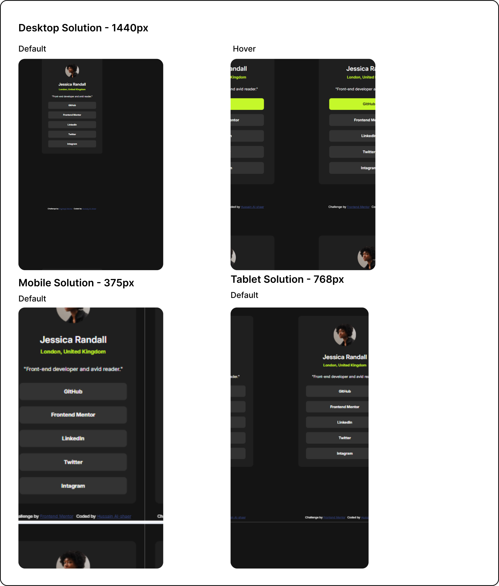

# Frontend Mentor - Social links profile solution

This is a solution to the [Social links profile challenge on Frontend Mentor](https://www.frontendmentor.io/challenges/social-links-profile-UG32l9m6dQ). Frontend Mentor challenges help you improve your coding skills by building realistic projects.

## Table of contents

- [Overview](#overview)
  - [The challenge](#the-challenge)
  - [Screenshot](#screenshot)
  - [Links](#links)
- [My process](#my-process)
  - [Built with](#built-with)
  - [What I learned](#what-i-learned)
  - [Continued development](#continued-development)
  - [Useful resources](#useful-resources)
- [Author](#author)
- [Acknowledgments](#acknowledgments)


## Overview

### The challenge

Users should be able to:

- See hover and focus states for all interactive elements on the page

### Screenshot




### Links

- Solution URL: [Solution link](https://github.com/hussaindev94/frontend-mentor-challenges-social-links-profile)
- Live Site URL: [Live link](https://hussaindev94.github.io/frontend-mentor-challenges-social-links-profile/)

## My process

### Built with

- Semantic HTML5 markup
- CSS custom properties
- Flexbox
- CSS Grid

### What I learned
1. padding-block:
  - This CSS property is for targeting the top & bottom padding.
2. padding-inline:
  - This CSS proeprty is for targeting the left & right padding.
```CSS
section{
  padding-block: clamp(24px, 4vw ,40px);
  padding-inline: clamp(0px, calc(10vw - 60px),40px);
  /*Same  as saying*/
  padding: 24px 40px 24px 40px;
}
```
3. conversion between  vw and px:
- I notice that we have different pading values for the section between the mobile and tablet.
  - so I assume the tablet has 1000px and mobile has 600px, and the padding is 40px 0px and 40px 24px.
  - This will make four points:
    (1000px, 40px)(600px, 0px) and (1000px, 40px)(600, 24px).
    - Solving this as linear equation will have dynamic sizing for the padding across different devices with out having media quieries.
    - y = Kx + b.

### Continued development

Use this section to outline areas that you want to continue focusing on in future projects. These could be concepts you're still not completely comfortable with or techniques you found useful that you want to refine and perfect.


## Author

- Website - [Hussain Alshaer](https://hussaindev94.github.io/Portfolio/)
- Frontend Mentor - [@hussaindev94](https://www.frontendmentor.io/profile/hussaindev94)
- Twitter - [@hussaindev94](https://x.com/hussaindev94)
